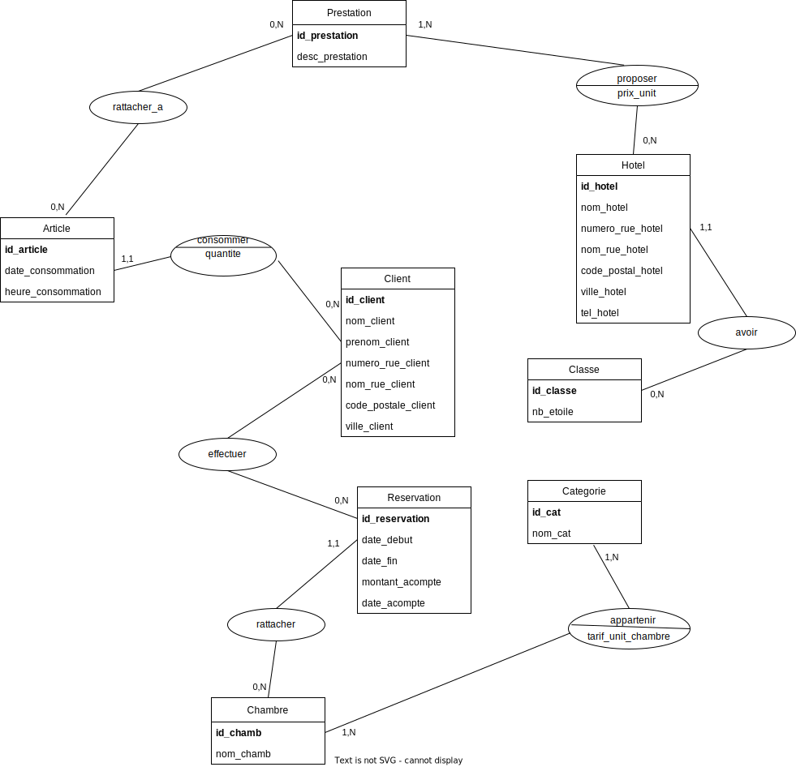
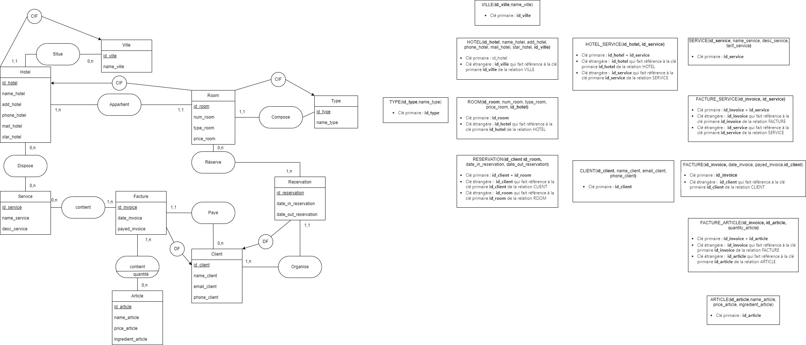
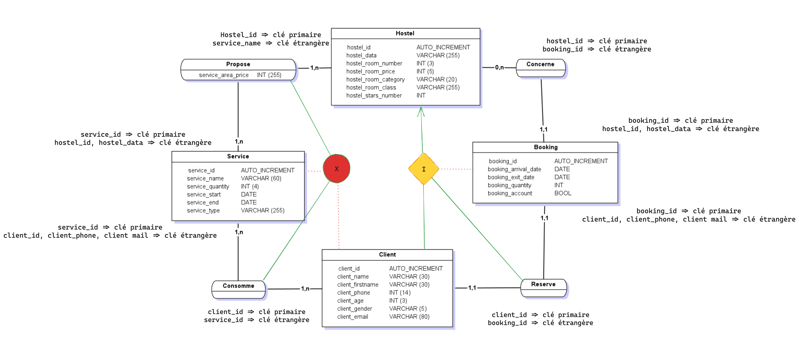
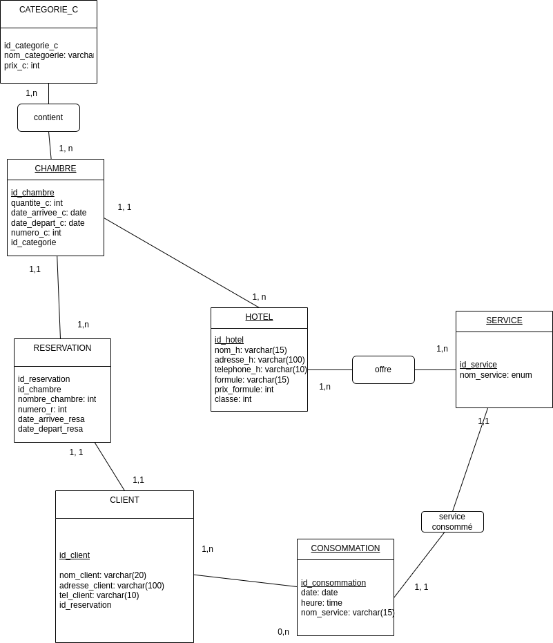

# Corrections des exercices 2, 4, 5 et 6 MCD et MLD de GT Toit

---

## MCD

### Solution 1

---

Ici, je généralise un service et une chambre dans une entité nommée Prestation dans le but de vous montrer plus efficacement les contraintes qu'on peut avoir au niveau de l'héritage.

---

## MLD

### Transformation de la solution 1 du MCD en MLD

Pour la transformation du MCD en MLD cf les règles de transformation dans le [cours](../../../cours/pdf/merise.pdf)
Dans le MCD, un attribut ou nom d'association doit être unique, cependant, il est toléré de garder les mêmes noms pour les clé-primaires et les clé-étrangères.
1. Prestation(**id_prestation**, desc_prestation)
- Clé primaire (PK) : **id_prestation**
2. Article(**id_article**, date_consommation, heure_consommation, *client*)
- PK : **id_article**
- clé étrangère (FK) : **client** fait référence à la PK **id_client** de Client
3. Chambre(**id_chamb**, nom_chamb)
- PK : **id_chamb**
4. Reservation(**id_reservation**, date_debut, date_fin, montant_acompte, date_acompte, *chambre*)
- PK : **id_reservation**
- FK : *chambre* fait référence à **id_chambre** de Chambre
5. Categorie(**id_cat**, nom_cat)
- PK : **id_cat**
6. Hotel(**id_hotel**, nom_hotel, numero_rue_hotel, nom_rue_hotel, code_postal_hotel, ville_hotel, tel_hotel, *classe*)
- PK : **id_hotel**
- FK : *classe* fait référence à **id_classe** de Classe
7. Classe(**id_classe**, nb_etoile)
- PK : **id_classe**
8. Client(**id_client**, nom_client, prenom_client, numero_rue_client, nom_rue_client, code_postale_client, ville_client)
- - PK : **id_client**
9. PrestationArticle(**prestation**,**article**, **quantite**)
- PK : couple **prestation** et **article**
- FK : *prestation* fait référence à la PK **id_prestation** de Prestation
- FK : *article* fait référence à la PK **id_article** de Article
10. PrestationHotel(**offre_prestation**, **hotel**, prix_unit)
- PK : couple **offre_prestation** et **hotel**
- FK : *offre_prestation* fait référence à la PK **id_prestation** de Prestation
- FK : *hotel* fait référence à la PK **id_hotel** de Hotel
11. ReservationClient(**reservation**, **client**)
- PK : couple **reservation** et **client**
- FK : **reservation** fait référence à la PK **id_reservation** de Reservation
- FK : **client** fait référence à la PK **id_client** de Client
12. CategorieChambre(**chambre**, **categorie**, tarif_unit_chambre)
- PK : couple **chambre** et **categorie**
- FK : **chambre** fait référence à **id_chambre** de Chambre
- FK : **categorie** fait référence à **id_cat** de Categorie

### Transformation de la solution 2 du MCD en MLD

- Similaire à la solution 1 sauf le cas spécifique de l'héritage. Nous avons vu en cours comment procéder et les différentes solutions possibles.
- Autre particularité, le CIF entre Client et Reservation donnera lieu à une FK dans Reservation qui fera référence à la PK de Client. Grâce à la CIF on évite d'avoir une table d'association composé du couple des PK de chaque entité.

---

## Corrections travaux stagiaires

### Commentaires généraux

- Attention à la syntaxe (formalisme MERISE) à respecter même lorsque vous utilisez les outils qui ne sont pas adaptés de base à la méthode comme par exemple draw.io. Appuyez-vous sur un modèle ou une documentation pour respecter la syntaxe de MERISE.
- Vous pouvez émettre des hypothèses pour concevoir votre MCD. Pensez à les valider ou à les infirmer avec la partie métier (client).
- Essayez de respecter toutes les règles métiers (RM).
- Itérez plusieurs fois sur votre MCD en vérifiant que toutes les RM sont respectées.

### Travaux groupe stagiaire 1 (GT1)

Félicitations, très bon travail, pas grand-chose à dire.
Dans l'énoncé, il était spécifié que le cadre d'étude ne prenait pas en compte la facturation donc on pouvait ignorer cette entité et rattaché article directement à l'entité *Article*. Cela n'a pas vraiment d'incidence sur la qualité et le résultat de votre travail.
Lorsque vous avez des DF, vous pouvez supprimer les associations concernées et les remplacer par la DF pour alléger votre modèle. Bravo pour la précision et la non-répétition des noms de propriétés et/ou des associations dans votre modèle.

---

### Travaux GT2

- Attention, il vous manque quelques entités pour répondre aux besoins du client, de ses règles de gestion et avoir toutes les propriétés que vous avez identifié dans votre dictionnaire des données.

- Attention également à la syntaxe concernant les associations. Lorsque l'association n'a pas d'attribut, il n'y a pas de séparation au niveau votre rectangle avec les angles arrondis. Par contre, lorsque l'association est porteuse d'attribut, il y a un trait pour séparer la partie supérieure dédiée au nom de l'association et la partie basse pour les propriétés.

- Attention, vos contraintes sont fausses. Entre les associations consomme et propose, il s'agit plutôt d'une inclusion, c'est-à-dire que le service consommé est un sous-ensemble du service proposé.
À droite vous n'avez pas d'inclusion. Pour rappel, la contrainte d'inclusion est possible uniquement au niveau des associations. De façon générale, les contraintes sont possibles soit au niveau de l'héritage ou des associations. Il y a cependant des contraintes qui ne sont possibles qu'au niveau des associations comme c'est le cas de l'inclusion.

- Attention, on n'est pas encore au niveau de la base de données, ou effectivement, les identifiants virtuels (qu'on a créé) seront auto-incrémentés. Ici, la règle est d'avoir un seul identifiant par entité, souligné et tout au début (en-tête des attributs).

---

### Travaux GT3

- Attention toute association entre 2 entités doivent être nommées, vous ne pouvez relier directement 2 entités. Je pense qu'ici, il y a eu une confusion avec UML ou cela est possible.

- Attention, id_categorie n'a pas sa place dans l'entité *CHAMBRE* à ce niveau (MCD). Il apparaîtra uniquement lors de la transformation de votre MCD en MLD en appliquant les règles de passage entre les deux modèles. Même remarque pour *id_chambre* dans *RESERVATION*. Idem *id_reservation* dans *CLIENT*. Idem *nom_service* dans *CONSOMMATION*.

- Il vous manque les associations porteuses d'attribut pour respecter les règles de gestion des prix.

---

### Travaux GT4

- Attention, les propriétés doivent être atomiques (cad contenir qu'une seule valeur ou attribut à la fois et non plusieurs). C'est le cas de *coordonnées* dans *HOTEL* qui n'est pas atomique ici. S'il s'agissait du numéro de téléphone, il est préférable de le nommer ainsi plutôt que coordonnées.
- Il faut avoir dans le MCD, qu'une seule fois le nom d'un attribut ou d'une association, c'est une règle du modèle. ICI, vous avez une répétition de *coordonnées* dans *SERVICE* et *HOTEL*.
- *type_de_service* ne doit pas apparaître du côté de l'entité *PRESTATION*, en effet on peut retrouver cette information grâce à l'association entre *SERVICE* et *PRESTATION*.
- *adresse_client* n'est pas atomique, il faut le décomposer par exemple en *numero_rue, nom_rue, code_postal, ville*.

---

### Travaux GT5

Par rapport à la solution 4, il y a eu du progrès.
- Attention, vous ne pouvez pas lier directement *HOTEL* à *CHAMBRE* sans nommer l'association qui fait le lien entre les deux entités. Idem pour *CHAMBRE* et *RESERVATION*. Idem entre *RESERVATION* et *CLIENT*, *CLIENT* et *CONSOMMATION*.
- Pareil que GT3, vous ne devez pas faire apparaitre les clés étrangères dans les entités. Dans le MCD, la notion de clé étrangère n'existe pas donc *id_reservation* dans *CLIENT*, *nom_service* dans *CONSOMMATION*, *id_categorie* dans *CHAMBRE*, *id_chambre* dans *RESERVATION* et j'en ai surement oublié d'autres... Ils ne doivent pas apparaitre dans ces entités.

