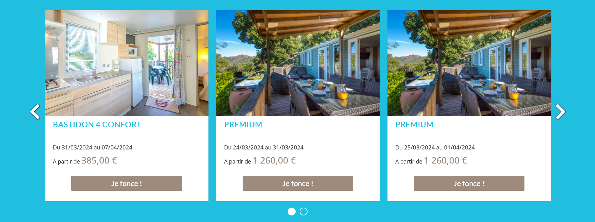
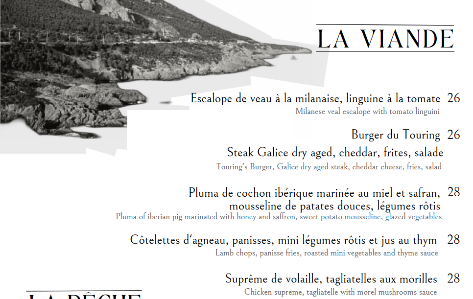
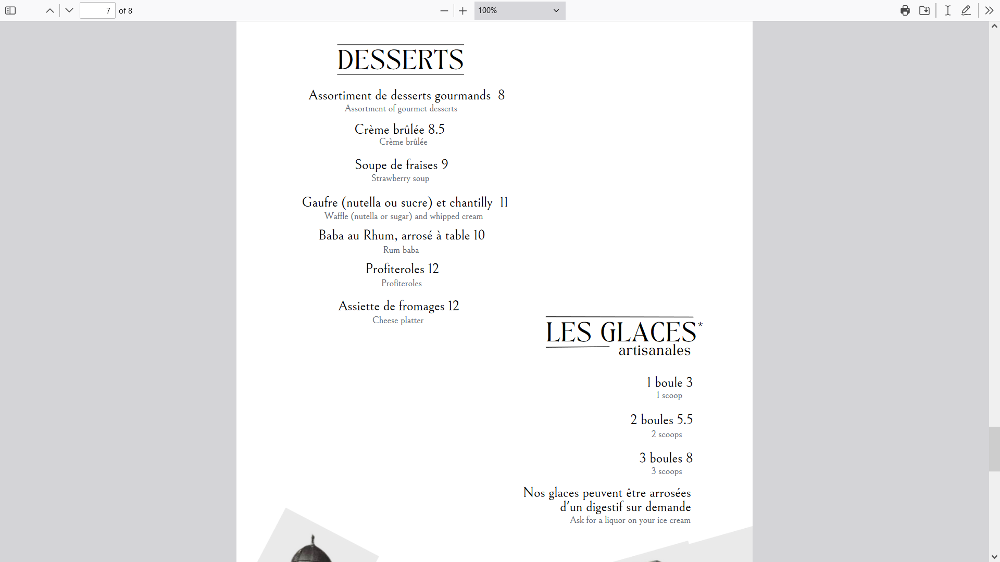

# Exercice 1

---

## Sources des images

- [Photos esterel caravaning](https://www.esterel-caravaning.fr/)
- [Photo carte letouring](https://www.letouring.fr/media/original/649c324c0084b/649c3290dc1e0/juin-2023-nouveau-menu-cafe-touring-1-.pdf)
- [Facture canva](https://marketplace.canva.com/EAFdiQrSv7U/2/0/1131w/canva-facture-de-vente-document-simple-vif-minimaliste-en-beige-vert-fonc%C3%A9-l2kQGXk-X68.jpg)

---

## Enoncé

1. Réalisez un dictionnaire des données des informations ci-dessous à partir de ce [modèle de dictionnaire des données](./ressources/dictionnaire_donnees.xlsx)

---

## Informations

Le groupe hôtellier GT Toit souhaite développer une application de gestion commune de tous ses hôtels repartis dans toute la France.

Chaque hôtel possède un nom, une adresse et des coordonnées.

Un hôtel est composé de plusieurs chambres. Les catégories sont standard, suite, villa et prenium permettent de déterminier la classe de la hotêl comprise entre 1 et 5 étoiles. Les catégories des chambres déterminent leurs tarifs.

Les services proposés sont la restauration, spa, massage, salle de sport, yoga, location de vélo, la blanchisserie, etc.

Un client consomme ou réserve un service à une date et une heure. L'hôtel comptabilise la prestation dans la facture en incluant le prix unitaire, la quantité consommée et le montant totale de celle-ci.

Les clients peuvent réserver des chambres entre une date d'arrivée et date de départ.

La partie facturation est gérée par une autre application. Le champ d'étude ne tiendra pas compte de la facturation, mais une facture ainsi que les informations ci-après sont mises à votre disposition.

---

---

---

---

## Règles métiers

1. Un hôtel ne peut avoir qu'une seule étoile
2. Entre deux date un client ne peut avoir qu'une seule réservation, par contre le client peut réserver plusieurs chambre à ces mêmes dates.
3. A la réservation l'acompte est versé, il doit être d'au moins 30 % du montant total.
4. Pour chaque consommation, on garde une date et heure
5. Chaque prestation possède un prix unitaire, cependant pour la même prestation, on peut avoir des prix différents d'un hôtel à un autre du groupe hôtellier GT Toit.
6. Une chambre ne peut pas avoir un numéro qui fini par le chiffre 13