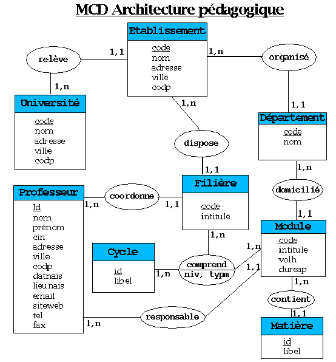

# Exercice 6

---

## Sources

- [Source image MCD sirius](https://sirius.sourceforge.net/co1v2-0_conception/node4.html)

---

# Enoncé

1. Transformez votre MCD en MLD en appliquant les règles de transformation et en réalisant un ***schéma linéaire***.
Pour réaliser votre schéma, appuyez-vous sur l'exemple ci-après

---

## Exemple de la transformation du MCD au MLD de la partie concernant l'association entre les entités Université et Etablissement

---

### MCD

---

### MLD

ETABLISSEMENT(**code_et**, nom_et, adresse_et, ville_et, codp_et, ***universite***)

- Clé primaire : **code_et**
- Clé étrangère : ***universite*** qui fait référence à la clé primaire **code_un** de la relation UNISERVITE

UNIVERSITE(**code_un**, nom_un, adresse_un, ville_un, codp_un)

- Clé primaire : **code_un**

