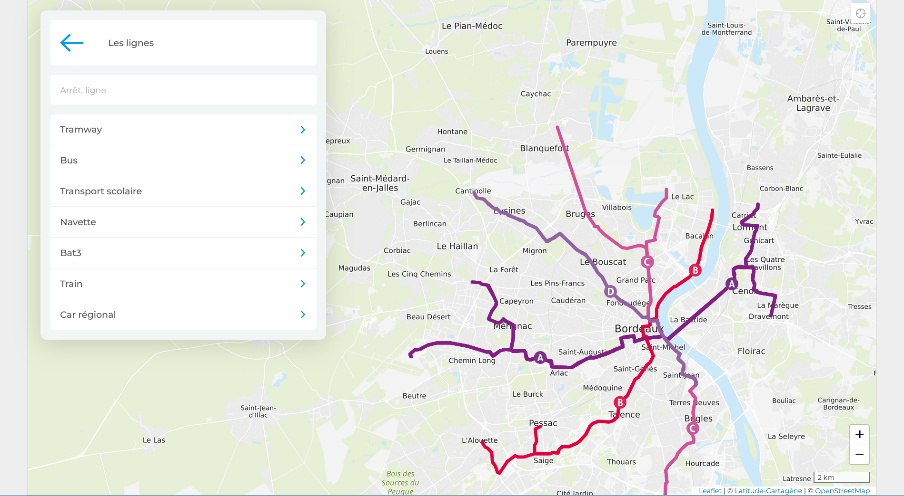

# TP : réseau transport Bordeaux

---

## Enoncé

Modélisez le réseau de transports TBM avec un modèle conceptuel des données. Pour cette étude, **nous allons nous restreindre uniquement au Tramway**.

---

## Informations à votre disposition

- Toutes les stations des 4 lignes de tramway sont accessibles. Du personnel TBM est également présent sur le réseau pour vous renseigner et vous aider.
- Sur toutes les stations
 - Information visuelle des prochains passages.
 - Plans de quartier orientés pour faciliter la fin de votre trajet.
 - Affichage grand format sur le fond de l’arrêt de la destination et des prochaines stations desservies.
 - Du personnel TBM est présent sur le réseau pour vous renseigner et vous aider.
 - Nous indiquons une estimation du temps d’attente.
 - Nous diffusons des annonces visuelles et sonores en station et dans les trams pour vous informer en cas de coupure.
 - Nous intervenons sur place (conducteurs, agents d’information…) pour vous renseigner et vous aider.

---

## Règles de gestion

---

