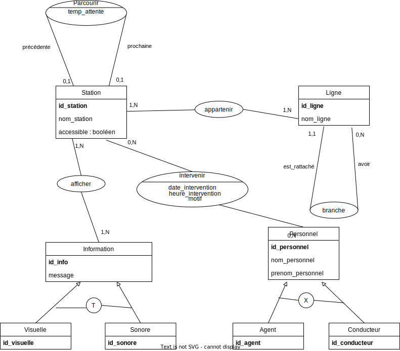

# Correction TP TBM

- Pas mal d'hypothèse ont été émise sur cette correction comme d'habitude à confirmer avec la partie métier.
- Pour les cardinalités max, on aurait pu mettre 4 en regardant le plan des lignes.

---

## Dictionnaire des données

- nom_station
- accessible
- id_personnel : virtuelle, n'a pas d'existence côté métier, il doit avoir un matricule, mais on n'a pas cette information dans le texte
- id_ligne : idem que id_personnel
- id_station : ""
- id_agent : ""
- id_conducteur : ""
- id_personnel : ""
- nom_personnel : déduction à confirmer avec le client
- prenom_personnel : déduction à confirmer avec le client
- date_heure_passage : donnée calculée par rapport au temps d'attente et à l'heure du système => n'apparaît pas dans le MCD
- arret_destination = nom_station on retrouvera cette info grâce à l'identifiant de la station
- arret_depart = nom_station on retrouvera cette info grâce à l'identifiant de la station
- temps_attente
- nom_ligne
- nom_branche
- message : message diffusé dans les stations de type sonore ou visuel
- date_intervention : hypothèse
- heure_intervention : hypothèse
- motif : hypothèse

---

## MCD restreint sur la partie Tramway

- Ignorer les entités Information et Personnel ainsi que leurs sous-types et associations associées à l'entité Station.

---

## MCD plus générale en intégrant les autres données du sujet

- Contrainte X entre Agent et Conducteur : un conducteur ne peut pas être un agent, vice-versa. agent + conducteur ne représentent  pas la totalité du personnel, le personnel peut être autre qu'un agent ou un conducteur.

- Contrainte totalité entre Visuelle et Sonore, une information peut être l'un ou l'autre ou les deux à la fois, l'ensemble représente  la totalité des informations. Il n'y a pas d'autres choix.

---

## MLD

1. Station(**id_station**, nom_station, id_station_precedente, id_station_suivante, temp_attente)
- Clé primaire (PK) : **id_station**
- Clé étrangère (FK) : **id_station_precedente** fait référence à **id_station** de Station
- FK : **id_station_suivante** fait référence à **id_station** de Station
2. Information(**id_info**, message)
- PK : **id_info**
2. InfoVisuelle(**id_visuelle**, **info**)
- PK : **id_visuelle**
- FK : **info** fait référence à **id_info** de Information
3. InfoSonore(**id_sonore**, **info**)
- PK : **id_sonore**
- FK : **info** fait référence à **id_info** de Information
4. Personnel(**id_personnel**, nom, prenom)
- PK : **id_personnel**
5. Agent(**id_agent**, *personnel*)
- PK : **id_agent**
- FK : **personnel** fait référence à **id_personnel** de Personnel
6. Conducteur(**id_conducteur**, *personnel*)
- PK : **id_conducteur**
- FK : **personnel** fait référence à **id_personnel** de Personnel
7. Ligne(**id_ligne**, nom_ligne, branche)
- PK : **id_ligne**
8. InformationStation(**station**,**info**)
- PK : couple **station** et **info**
- FK : **station** fait référence à **id_station** de Station
- FK : **info** fait référence à **id_info** de Information
9. InterventionPersonnel(**personnel**, **station**, date_intervention, heure_intervention, motif)
- PK : couple **personnel** et **station**
- FK : **personnel** fait référence à **id_personnel** de Personnel
- FK : **station** fait référence à **id_station** de Station
10. LigneStation(**station**, **ligne**)
- PK : couple **station** et **ligne**
- FK : **ligne** fait référence à **id_ligne** de Ligne
- FK : **station** fait référence à **id_station** de Station

Avec cette solution, on va avoir une redondance (répétition) du nom de la station. En effet, dans le cas où la station est une station de synchronisation ou de bifurcation entre 2 branches, il faudra stocker d'un côté la station avec les stations précédente et suivante d'une branche A puis restocker toujours la même station, cette fois-ci avec les stations précédente et suivante de l'autre branche B. Le nom sera le même mais l'identifiant de la station sera bien distinct. 